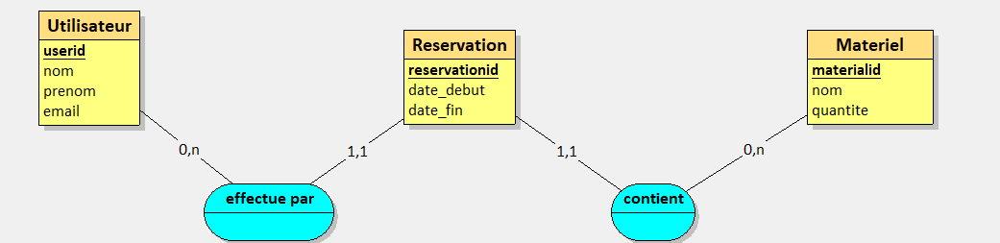

# Exercice 1

Le Modèle Conceptuel de Données :


Le Modèle Logique de Données :


Nous avons donc 3 entités distinctes:
- Utilisateur
    Cette entité contient un attribut userid (qui est la primary key) ainsi que les attributs nom, prenom et email (qui sont des chaîne de caractères)

- Materiel
    Cette entité contient un attribut materialid (qui est la primary key) ainsi que l'attribut nom (qui est une chaîne de caractères) et l'attribut quantité (qui est un entier)

- Reservation
    Cette entité contient un attribut reservationid (qui est la primary key) ainsi que les attributs date début et date de fin (qui sont des horodates)

De là, deux associations sont créées :
- effectue par
    Cette association reliant Utilisateur (cardinalité 0,n car un utilisateur n'a pas forcément de réservation et peut en avoir plusieurs) et Reservation (cardinalité 1,1 car une réservation a forcément un utilisateur associé à celle ci)

- contient
    Cette association reliant Materiel (cardinalité 0,n car le matériel n'est pas forcément réservé et il peut être réservé plusieurs fois tant qu'il ne soit pas réservé sur la même période mais ça ça pourra être programmé plus tard) et Reservation (cardinalité 1,1 car une réservation a forcément un matériel associé à celle ci)

Les différentes tables ont été créé avec la requête SQL :
```sql
CREATE TABLE Utilisateur(
   userid SERIAL,
   nom VARCHAR(50)  NOT NULL,
   prenom VARCHAR(50)  NOT NULL,
   email VARCHAR(60)  NOT NULL,
   PRIMARY KEY(userid)
);

CREATE TABLE Materiel(
   materialid SERIAL,
   nom VARCHAR(50)  NOT NULL,
   quantite INTEGER NOT NULL,
   PRIMARY KEY(materialid)
);

CREATE TABLE Reservation(
   reservationid SERIAL,
   date_debut TIMESTAMP NOT NULL,
   date_fin TIMESTAMP NOT NULL,
   materialid INTEGER NOT NULL,
   userid INTEGER NOT NULL,
   PRIMARY KEY(reservationid),
   FOREIGN KEY(materialid) REFERENCES Materiel(materialid),
   FOREIGN KEY(userid) REFERENCES Utilisateur(userid)
);
```

Pour compléter la table utilisateur la requête ci dessous a été utilisé :
```sql
INSERT INTO utilisateur (nom, prenom, email)
VALUES ('Bolard', 'Yassine', 'yassine.bolard@gmail.com'),
('Parat', 'Eliot', 'eliot.parat@gmail.com'),
('Herzi', 'Anes', 'anes.herzi@gmail.com'),
('Manso', 'Alexis', 'alexis.manso@gmail.com'),
('Jordan', 'Michael', 'michael.jordan@gmail.com'),
('Monstre', 'Double', 'guacamole@gmail.com'),
('Frisé', 'Patate', 'patate@gmail.com'),
('Drucker', 'Michel', 'cafe@gmail.com'),
('Quartararo', 'Fabio', 'quartararo@gmail.com'),
('Zarco', 'Johan', 'johan.zarco@gmail.com');
```

Pour compléter la table matériel la requête ci dessous a été utilisé avec uniquement besoin de remplacer ce qu'il y a entre les guillemets "":
```sql
INSERT INTO materiel (nom, quantite) VALUES
('Ordinateur portable', 5),
('Vidéo-projecteur', 3),
('Tableau blanc', 2),
('Câble HDMI', 10),
('Multiprise', 7),
('Microphone', 4),
('Casque audio', 6),
('Caméra web', 3),
('Pointeur laser', 8),
('Station de charge', 2);
```

Pour compléter la table réservation la requête ci dessous a été utilisé avec uniquement besoin de remplacer ce qu'il y a entre les guillemets "" et quantite (dans VALUES) par un entier:
```sql
INSERT INTO Reservation (date_debut, date_fin, materialid, userid) VALUES
('2025-05-20 09:00:00', '2025-05-20 12:00:00', 3, 7),
('2025-05-21 14:00:00', '2025-05-21 16:30:00', 5, 2),
('2025-05-22 08:30:00', '2025-05-22 10:00:00', 1, 9),
('2025-05-23 13:00:00', '2025-05-23 17:00:00', 8, 4),
('2025-05-24 10:00:00', '2025-05-24 11:00:00', 6, 1);
```